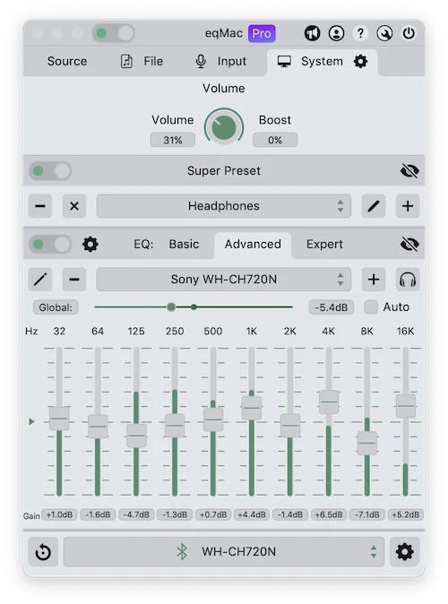

Since 2019, I had been rocking a pair of TaoTronics SoundSurge 60 headphones I bought on German Amazon for 47€. Sehr guter Preis, oder? I bought them blindly, as I was looking for moderately priced noise-cancelling over-ear headphones, and that particular model seemed like a bang for the buck. Reviews were generally positive, though trusting Amazon reviews is about as smart as trusting Michael Jackson for last-minute babysitting. The sound quality was far from perfect but definitely not terrible. They were comfy, and the ANC was really good—it upheld my sanity on many flights.

After five years of honorable service, they finally gave up: the faux leather on the headband peeled off, the battery stopped charging, and one day I came home only to find that both earcups had decided to go their separate ways. I still can’t figure out how that happened. I suspect irreconcilable differences. So, I pressed <kbd>F</kbd> to pay respects and looked to the horizon as they sailed off to the E-waste-halla on a burning drakkar.

**Curb Your Bass-thusiasm** equalizer settings:

| 400 | 1k | 2,5k | 6,3k | 16k | Clear Bass |
|:---:|:--:|:----:|:----:|:---:|:--------------:|
|  -6 |  0 |   0  |  +1  |  +3 |        +3       |

**We Have Ushuaïa at Home** equalizer settings:

| 400 | 1k | 2,5k | 6,3k | 16k | Clear Bass |
|:---:|:--:|:----:|:----:|:---:|:--------------:|
|  +1 |  0 |   +2  |  +6  |  +9 |        +6       |

Cans cans cans. Since 2019, I was rocking a pair of TaoTronics SoundSurge 60 I bought on German Amazon for 47€. I pressed <kbd>F</kbd> to pay respects, then looked at the horizon as they sailed off to the E-waste-halla on a burning drakkar.Cans cans cans. Since 2019, I was rocking a pair of TaoTronics 

The app is pretty on the outside, but on the inside—sometimes scruffy. Image by Ł.P. Credit: Sony / Meta

SoundSurge 60 I bought on German Amazon for 47€. I pressed <kbd>F</kbd> to pay respects, then looked at the horizon as they sailed off to the E-waste-halla on a burning drakkar.Cans cans cans. Since 2019, I was rocking a pair of TaoTronics 

 Credit: Roman Kisil, Bitgapp / Apple