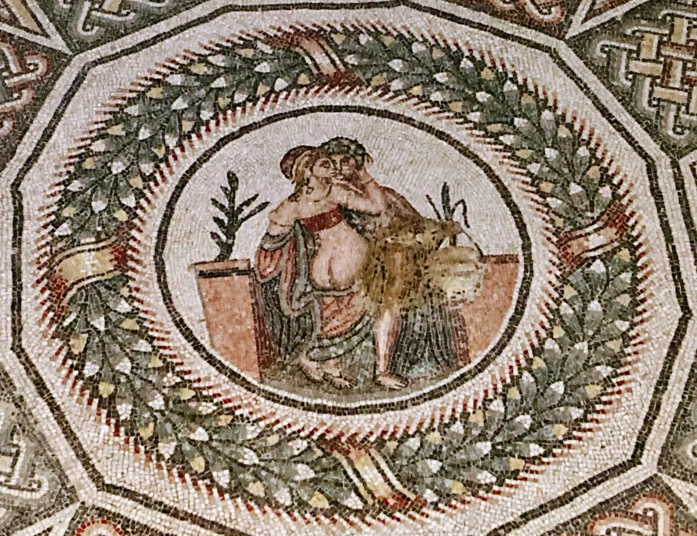
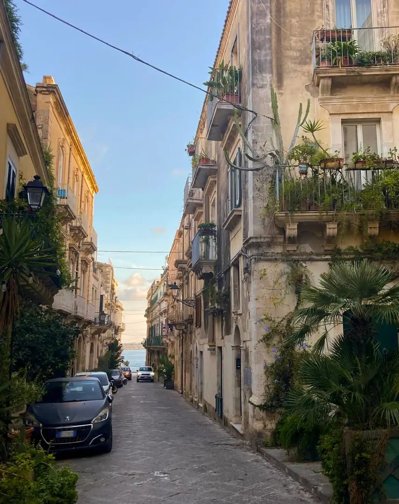

Eastern Sicily―An alluring shadow of its somber, but glamorous past.

Psyche and Cupid in the throes of passion. Photo by Ł. Pojezierski, licensed under <a href="https://creativecommons.org/licenses/by-nc-nd/4.0/deed">CC BY-NC-ND 4.0</a>

blablablbalbablaabla

Some quiet street in Syracuse. Photo by Ł. Pojezierski, licensed under <a href="https://creativecommons.org/licenses/by-nc-nd/4.0/deed">CC BY-NC-ND 4.0</a>

dasdassa