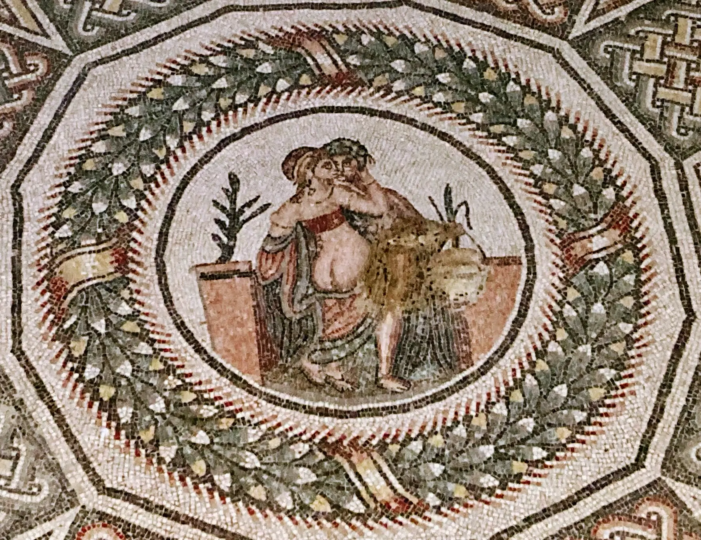
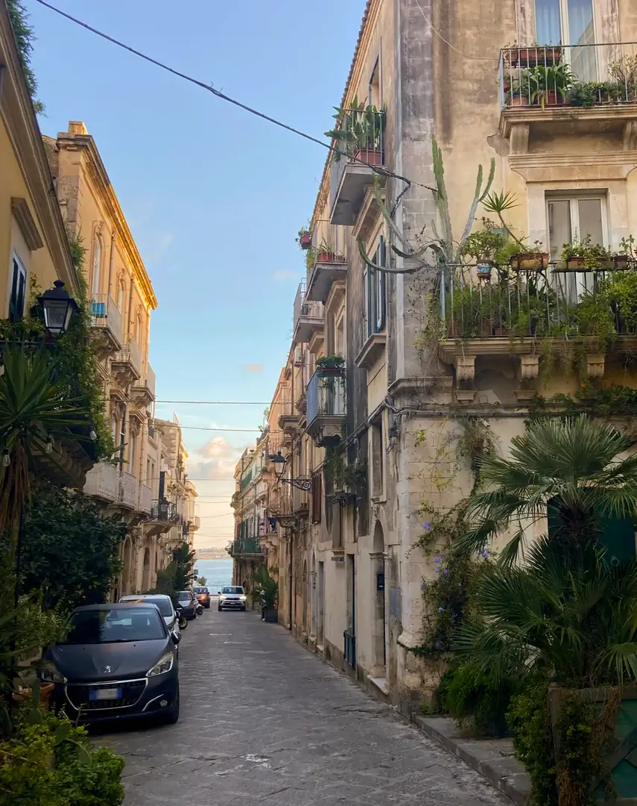
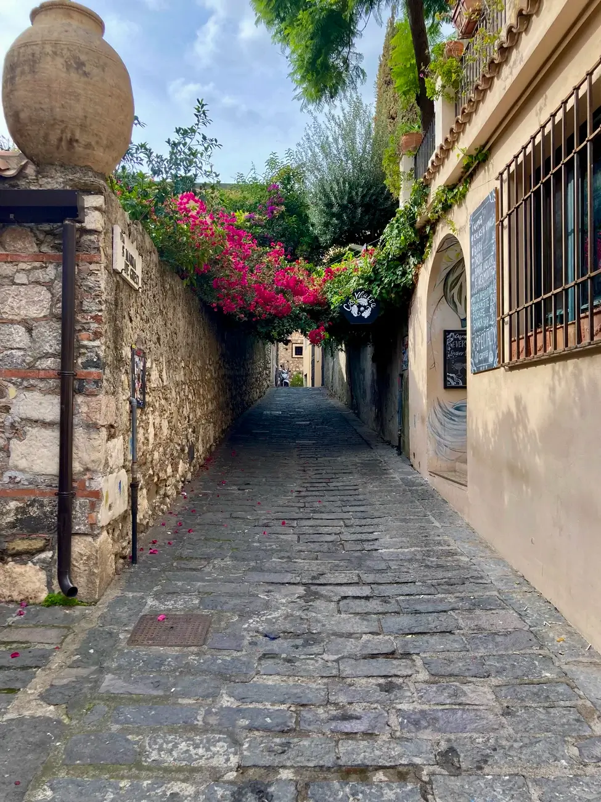

A week of wandering along the East of Sicily taught me valuable lessons about what to expect from the biggest island in the Mediterranean. Still, seven days is just a fraction of the time you need to fully grasp the good, the bad, and the ugly of Eastern Sicily. 

Let’s get it straight out of the way: Catania is a pig pen put in the middle of a lush garden. Okay, on the first glimpse, Catania is disappointing, to say the least. 

 Psyche and Cupid in the throes of passion. Photo by Ł. Pojezierski, licensed under <a href="https://creativecommons.org/licenses/by-nc-nd/4.0/deed" target="_blank">CC BY-NC-ND 4.0</a>

blablablbalbablaabla

 A backstreet in Syracuse. Photo by Ł. Pojezierski, licensed under <a href="https://creativecommons.org/licenses/by-nc-nd/4.0/deed" target="_blank">CC BY-NC-ND 4.0</a>

dasdassa

 One of the few quiet alleys in Taormina. Photo by Ł. Pojezierski, licensed under <a href="https://creativecommons.org/licenses/by-nc-nd/4.0/deed" target="_blank">CC BY-NC-ND 4.0</a>

dasdassa