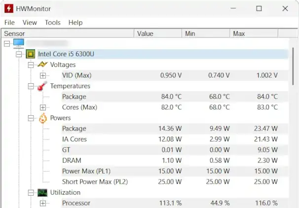

I've got myself a rather cute Lenovo ThinkPad X270: i5, 16 gigs of RAM, NVMe SSD, and a 12.5" 1080p IPS touchscreen. It's not a new machine by any means, but thanks to its top-notch build quality, it feels and looks like new. Pretty cool. 

"But hey, don't you already have a new laptop?" you may ask. And that’s true! I enjoy working at home on the 15-inch M3 MacBook Air, but pairing it with my butterfingers is a recipe for the next episode of _CSI_—the one where I go postal before shooting myself in the head with a bow and arrow. Besides, I'm not keen on lugging a brand-new machine across Europe when all I need on trips is a computer for basic tasks like text processing and editing spreadsheets. I’ve tried traveling with an iPad paired with a dedicated keyboard, but I just can't overcome the limitations of iPadOS—even with a mouse hooked up—and the cramped keyboard layout.

As you might have figured out by now, I am a big Apple fan: I've been daily driving Macs since 2011.

 I don't want to burn the Midnight Oil when my Hands Are Burning. Do you get the joke? Credit: CPUID / Microsoft

WARNING This walkthrough has been tested on a Lenovo ThinkPad X270 (Intel Core i5-6300U, Windows 11) and it worked for me. However, please note that overclocking your CPU carries the risk of causing irreversible damage to your computer. I am not responsible for any loss or damage resulting from following this guide. Proceed at your own risk.

 Hideous and too powerful—just like Donald Trump. Credit: Kevin Glynn / Microsoft

 This is the playground. Careful with that axe, Eugene. Credit: Kevin Glynn / Microsoft

 Just one small setting makes a difference. Credit: Kevin Glynn / Microsoft